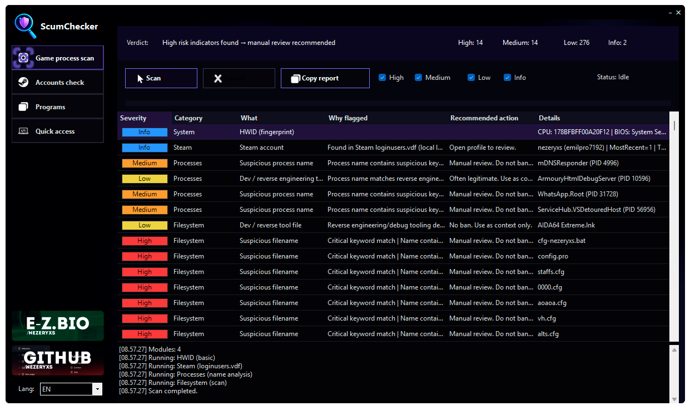
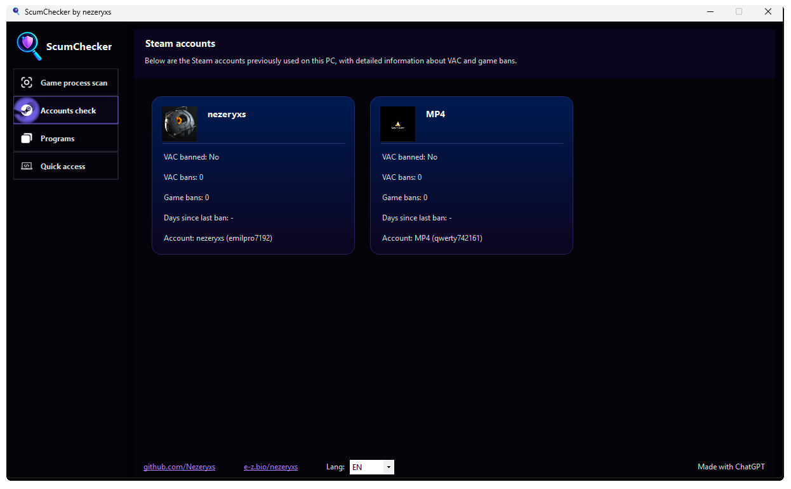
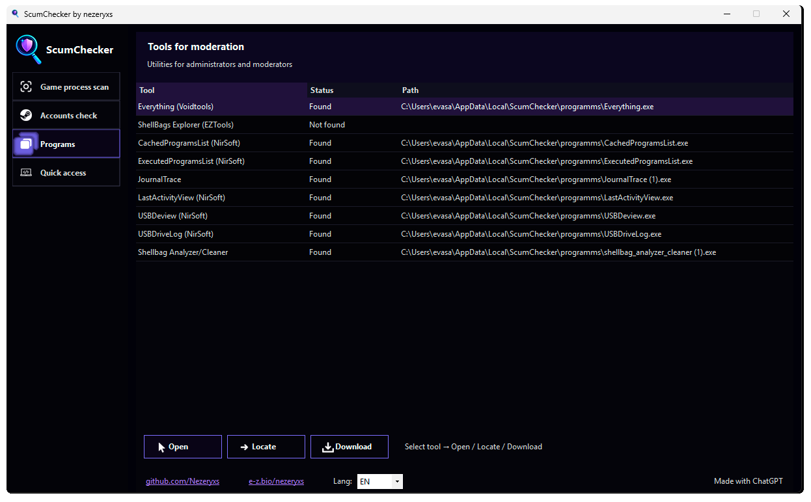
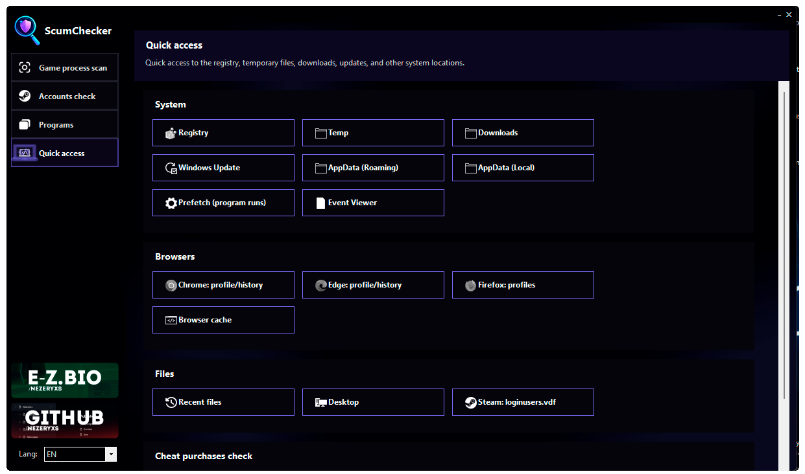

# ScumChecker

---

## 🇷🇺 Описание

**ScumChecker** — офлайн-инструмент для администраторов серверов **SCUM**, предназначенный для помощи при ручных проверках игроков.

ScumChecker **не отправляет данные**, **не загружает файлы** и **не взаимодействует с внешними серверами**.  
Вся обработка выполняется **локально на компьютере администратора**.

---

## 🇬🇧 Description

**ScumChecker** is an offline tool for **SCUM** server administrators, designed to assist with **manual player investigations**.

ScumChecker **does not send data**, **does not upload files**, and **does not communicate with external servers**.  
All processing is performed **locally on the administrator’s machine**.

---

## 🖥 Интерфейс / Interface

---

## 🔍 Возможности / Features

### 🇷🇺 Возможности
- Поиск подозрительных процессов и файлов  
- Разделение находок по уровням риска (**Info / Low / Medium / High**)  
- Анализ системных индикаторов и окружения  
- Отображение истории Steam-аккаунтов (`loginusers.vdf`)  
- Быстрый переход к Steam-профилям  
- Встроенные инструменты для модерации (Everything, ShellBags и др.)  
- Полностью офлайн-работа (без отправки данных)

### 🇬🇧 Features
- Detection of suspicious processes and files  
- Classification by risk level (**Info / Low / Medium / High**)  
- System indicators and environment analysis  
- Display of Steam account history (`loginusers.vdf`)  
- Quick access to Steam profiles  
- Built-in moderation tools (Everything, ShellBags, etc.)  
- Fully offline operation (no data transmission)

---

## ⚠️ Важно / Important

### 🇷🇺 Важно
- ScumChecker **не является античитом**
- Программа **не выполняет автоматические наказания**
- Наличие программ или файлов **не является доказательством использования читов**
- Все выводы должны анализироваться **администратором вручную**

### 🇬🇧 Important
- ScumChecker **is not an anti-cheat**
- The application **does not apply automatic punishments**
- The presence of files or programs **does not prove cheating**
- All findings must be **manually reviewed by an administrator**

---

## 🔒 Конфиденциальность / Privacy

### 🇷🇺 Конфиденциальность
ScumChecker:
- ❌ не загружает файлы  
- ❌ не отправляет данные  
- ❌ не собирает личную информацию  
- ❌ не вмешивается в работу системы  

Вся обработка выполняется локально.

### 🇬🇧 Privacy
ScumChecker:
- ❌ does not upload files  
- ❌ does not send data  
- ❌ does not collect personal information  
- ❌ does not interfere with system operation  

All processing is done locally.

---

## 🚀 Использование / Usage

### 🇷🇺 Использование
1. Скачайте последний релиз в разделе **Releases**
2. Запустите `ScumChecker.exe` **от имени администратора**
3. Нажмите **Scan**
4. Изучите результаты и Steam-аккаунты
5. Используйте **double-click** для открытия файлов или Steam-профилей

### 🇬🇧 Usage
1. Download the latest release from the **Releases** section
2. Run `ScumChecker.exe` **as Administrator**
3. Click **Scan**
4. Review the results and Steam accounts
5. Use **double-click** to open files or Steam profiles

---

## 📄 Лицензия / License

Проект распространяется по лицензии **MIT**.  
Разрешено использование, модификация и распространение при сохранении авторства.

This project is licensed under the **MIT License**.  
You are free to use, modify, and distribute it with attribution.

---

## 👤 Автор / Author

**nezeryxs**  
GitHub: https://github.com/Nezeryxs  
Bio: https://e-z.bio/nezeryxs  

> Проект создан при помощи ChatGPT  
> Project created with the assistance of ChatGPT
