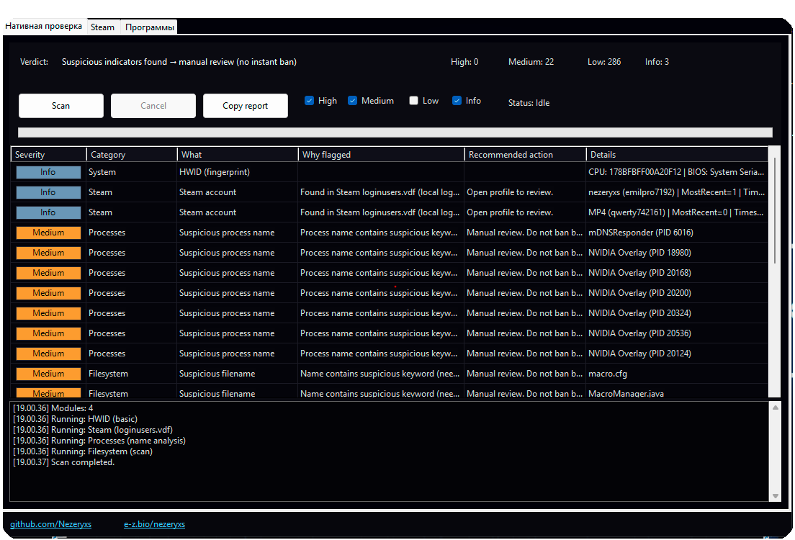
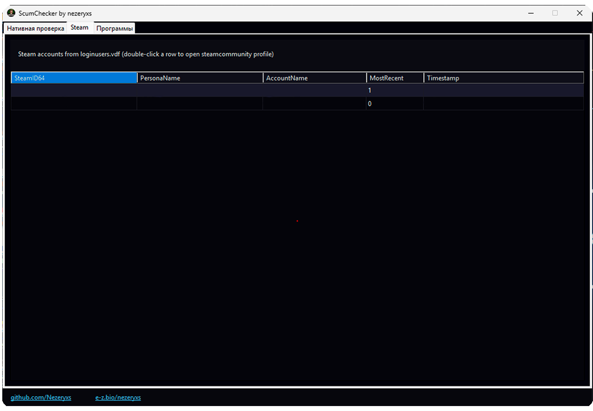

# ScumChecker

**ScumChecker** — офлайн-инструмент для администраторов серверов **SCUM**, предназначенный для помощи при ручных проверках игроков.
  
ScumChecker не отправляет данные, не загружает файлы и не взаимодействует с внешними серверами.

---

## 🖥 Интерфейс

---

## 🔍 Возможности

- Поиск подозрительных процессов и файлов  
- Разделение находок по уровням риска (**Info / Low / Medium / High**)  
- Анализ системных индикаторов и окружения  
- Отображение истории Steam-аккаунтов (`loginusers.vdf`)  
- Быстрый переход к Steam-профилям  
- Встроенные инструменты для модерации (Everything, ShellBags и др.)  
- Полностью офлайн-работа (без отправки данных)

---

## ⚠️ Важно

- ScumChecker **не является античитом**
- Программа **не выполняет автоматические наказания**
- Наличие программ или файлов **не является доказательством использования читов**
- Все выводы должны анализироваться **администратором вручную**

---

## 🔒 Конфиденциальность

ScumChecker:
- ❌ не загружает файлы
- ❌ не отправляет данные
- ❌ не собирает личную информацию
- ❌ не вмешивается в работу системы

Вся обработка выполняется локально.

---

## 🚀 Использование

1. Скачайте последний релиз из раздела **Releases**
2. Запустите `ScumChecker.exe` **от имени администратора**
3. Нажмите **Scan**
4. Изучите результаты и Steam-аккаунты
5. Используйте **double-click** для открытия файлов или Steam-профилей

---

## 📄 Лицензия

Проект распространяется по лицензии **MIT**.  
Разрешено использование, модификация и распространение при сохранении авторства.

---

## 👤 Автор

**nezeryxs**  
GitHub: https://github.com/Nezeryxs  
Bio: https://e-z.bio/nezeryxs  

> Проект создан при помощи ChatGPT
